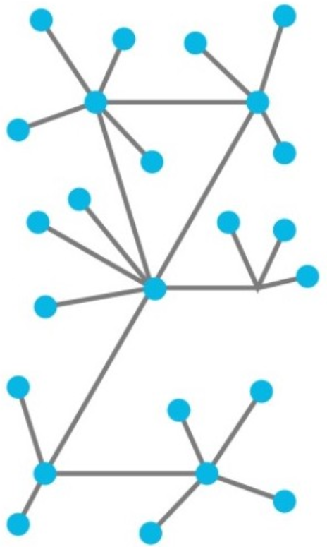
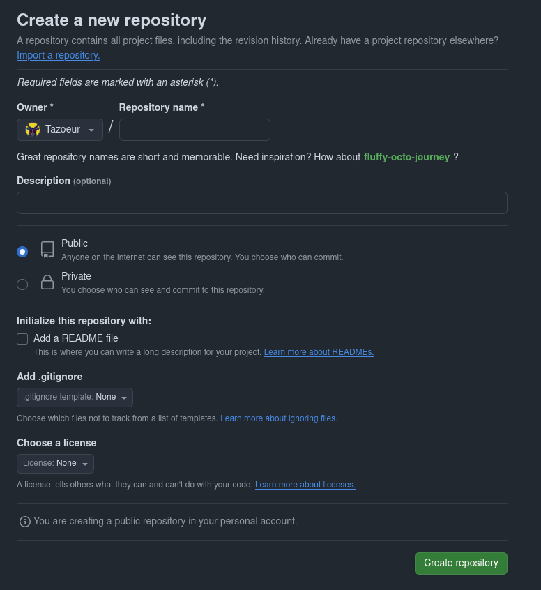
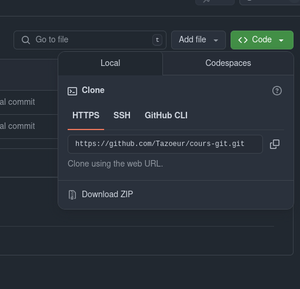

<style scoped>
p {
    font-size: 20px;
}
</style>
<style>
  .container {
    display: flex;
  }
  .col {
    flex: 1;
  }
</style>
<!-- header: Git > Introduction -->
<!-- _header: '' -->
<!-- _paginate: false -->
<!-- _class: moon -->


# Git

---

1. Introduction
2. Git en local
3. Git à plusieurs
4. Les problèmes

---

### C'est quoi git ?

git est un logiciel de gestion de version décentralisé créé par Linus Torvalds en 2005 et sans cesse amélioré depuis

> Chaque seconde de la conférence [Linus Torvalds & git](https://www.youtube.com/watch?v=idLyobOhtO4) mérite votre attention.

---

### C'est quoi la gestion de version ?

Garder un historique des modifications: qui a fait quoi et quand?

Avant git, la meilleure façon de faire (selon Linus) était d'avoir des archives `tar` avec une nomenclature qui permet de s'y retrouver.

---

### Pourquoi "décentralisé" est important ?

* Il n'y a pas un unique point central qui garde les données
* Il est possible de travailler _offline_
* Aucun endroit n'est plus important que n'importe quel autre
* Pas de problèmes liés au "commit access"

---

### Concepts clefs

* Un _**repository**_ est le contenant du projet.
* Un _**commit**_ contient un ensemble de modifications apportées au projet. Celles-ci sont datées et l'auteur est identifié sur chacune d'entre elles.
* Une **branche** est un enchainement de commit qui partagent une idée commune.

---


---

### Les outils

* CLI >>> tout le reste
  * précision
  * performances
  * utilisation dans des scripts
* ya des GUI qui existent...

---

### Installation

Sur [la page téléchargement du site git-scm.com](https://git-scm.com/downloads), téléchargez et installez git.

```
$ git --version
git version 2.34.1
```

---
<!-- header: Git > Git en local -->
<!-- _header: '' -->
<!-- _paginate: false -->
<!-- _class: moon -->
# Git en local

---

### Init

On peut se créer un petit projet C\# avec

```bash
dotnet new console -n git_cshonsole
cd git_cshonsole
ls -la # `dir` si vous utilisez un OS inférieur
git init
ls -la
```

---

### Le dossier `.git`

La puissance d'un _repository_, juste pour vous.

```
.
├── branches
├── config
├── description
├── HEAD
├── hooks
├── info
├── objects
└── refs
```

---

### `git status`

```bash
$ git status --help
GIT-STATUS(1)                         Git Manual                        GIT-STATUS(1)

NAME
       git-status - Show the working tree status

SYNOPSIS
       git status [<options>...] [--] [<pathspec>...]

DESCRIPTION
       Displays paths that have differences between the index file and the current
       HEAD commit, paths that have differences between the working tree and the
       index file, and paths in the working tree that are not tracked by Git (and are
       not ignored by gitignore(5)). The first are what you would commit by running
       git commit; the second and third are what you could commit by running git add
       before running git commit.
```

---

La commande `git status` permet de connaitre l'état de votre espace de travail.

```bash
$ git status
On branch master

No commits yet

Untracked files:
  (use "git add <file>..." to include in what will be committed)
        Program.cs
        git_cshonsole.csproj
        obj/

nothing added to commit but untracked files present (use "git add" to track)
```

---

### États de fichier


Les fichiers présents dans un _repository_ git se voient assigné un état par git.

Il est alors possible de voir rapidement quels sont les fichiers modifiés ou quels sont les fichiers qui vont être inclus dans le prochain commit.

---

### `git add`

```bash
$ git add --help
GIT-ADD(1)                            Git Manual                           GIT-ADD(1)

NAME
       git-add - Add file contents to the index

SYNOPSIS
       git add [--verbose | -v] [--dry-run | -n] [--force | -f] [--interactive | -i] [--
patch | -p]

DESCRIPTION
       This command updates the index using the current content found in the working
       tree, to prepare the content staged for the next commit. It typically adds the
       current content of existing paths as a whole, but with some options it can
       also be used to add content with only part of the changes made to the working
       tree files applied, or remove paths that do not exist in the working tree
       anymore.

       [...]
```

---

```bash
$ git add .
$ git status
On branch master

No commits yet

Changes to be committed:
  (use "git rm --cached <file>..." to unstage)
 new file:   Program.cs
 new file:   git_cshonsole.csproj
 new file:   obj/git_cshonsole.csproj.nuget.dgspec.json
 new file:   obj/git_cshonsole.csproj.nuget.g.props
 new file:   obj/git_cshonsole.csproj.nuget.g.targets
 new file:   obj/project.assets.json
 new file:   obj/project.nuget.cache
```

---

Pour _unstage_ un fichier, utiliser `git rm --cached`

```bash
$ git rm --cached -r obj # -r pour "recursive"
$ git status
On branch master

No commits yet

Changes to be committed:
  (use "git rm --cached <file>..." to unstage)
 new file:   Program.cs
 new file:   git_cshonsole.csproj

Untracked files:
  (use "git add <file>..." to include in what will be committed)
 obj/
```

---

### `git commit`

`git commit` permet d'effectuer un snapshot de la version actuelle, en ajoutant le code "staged" dans l'arborescence git.

```bash
$ git commit -m "init"
[master (root-commit) 776a8f2] init
 2 files changed, 12 insertions(+)
 create mode 100644 Program.cs
 create mode 100644 git_cshonsole.csproj
$ git status
On branch master
Untracked files:
  (use "git add <file>..." to include in what will be committed)
 obj/

nothing added to commit but untracked files present (use "git add" to track)
```

---

### `.gitignore`

Le `.gitignore` est un fichier qui permet à git d'ignorer des fichiers/dossiers.
Cela empêche de `commit` des données sensibles, ou d'avoir de la pollution via le `git status`.

```
# Dans `.gitignore`
[Oo]bj/
```

```bash
$ git status
On branch master
Untracked files:
  (use "git add <file>..." to include in what will be committed)
 .gitignore

nothing added to commit but untracked files present (use "git add" to track)
```

---

```bash
$ git add .gitignore
$ git commit -m "ignore obj folder"
[master 7ddaeac] ignore obj folder
 1 file changed, 1 insertion(+)
 create mode 100644 .gitignore
$ git status
On branch master
nothing to commit, working tree clean
```

---

```bash
$ dotnet build
MSBuild version 17.8.19+c3ade832a for .NET
  Determining projects to restore...
  All projects are up-to-date for restore.
  git_cshonsole -> /tmp/git_cshonsole/bin/Debug/net8.0/git_cshonsole.dll

Build succeeded.
    0 Warning(s)
    0 Error(s)

Time Elapsed 00:00:06.79
$ git status
On branch master
Untracked files:
  (use "git add <file>..." to include in what will be committed)
 bin/

nothing added to commit but untracked files present (use "git add" to track)
```

---

### Un `.gitignore` de pro

```bash
$ curl -sL https://www.toptal.com/developers/gitignore/api/csharp > .gitignore
$ git status
On branch master
Changes not staged for commit:
  (use "git add <file>..." to update what will be committed)
  (use "git restore <file>..." to discard changes in working directory)
 modified:   .gitignore

no changes added to commit (use "git add" and/or "git commit -a")
```

---

### `git diff`

```diff
diff --git a/.gitignore b/.gitignore                                                                        
index 760f99c..30a404f 100644
--- a/.gitignore
+++ b/.gitignore
@@ -1 +1,402 @@
+# Created by https://www.toptal.com/developers/gitignore/api/csharp
+# Edit at https://www.toptal.com/developers/gitignore?templates=csharp
+
+### Csharp ###
+## Ignore Visual Studio temporary files, build results, and
+## files generated by popular Visual Studio add-ons.
+##
+## Get latest from https://github.com/github/gitignore/blob/main/VisualStudio.gitignore
+
+# User-specific files
+*.rsuser
+[Aa][Rr][Mm]/
+[Aa][Rr][Mm]64/
+bld/
+[Bb]in/
 [Oo]bj/
+[Ll]og/
+[Ll]ogs/
[...]
```

---

### `git log`

```bash
$ git log
commit 285f6ae19334a99168aa639bc251f82630d96cc8 (HEAD -> master)            
Author: Tazoeur <g0latour@gmail.com>
Date:   Mon Mar 31 17:19:56 2025 +0200

    profesionnal ignore

commit 7ddaeacb1e9ac91288b865666a90046b02f60133
Author: Tazoeur <g0latour@gmail.com>
Date:   Mon Mar 31 16:52:01 2025 +0200

    ignore obj folder

commit 776a8f28ddcc7b7bddcae49e7f1ded8c61418e15
Author: Tazoeur <g0latour@gmail.com>
Date:   Mon Mar 31 16:43:29 2025 +0200

    init
```

---

`git log` est flexible sur la vue que l'on souhaite avoir

```bash
$ git log --one-line
285f6ae (HEAD -> master) profesionnal ignore
7ddaeac ignore obj folder
$ git log --all --decorate --oneline --graph # log A DOG
* 285f6ae (HEAD -> master) profesionnal ignore
* 7ddaeac ignore obj folder
* 776a8f2 init
```

---

### Les branches

Créer une branche est très facile avec `git branch`.

```bash
$ git branch develop
$ git log --all --decorate --oneline --graph
* 285f6ae (HEAD -> master, develop) profesionnal ignore
* 7ddaeac ignore obj folder
* 776a8f2 init
$ git status
On branch master
nothing to commit, working tree clean
```

---

### `git checkout`

Pour se déplacer de branche en branche, on peut utiliser la commande `git checkout`, même si la nouvelle documentation a plutôt l'air de recommander `git switch <branch>`.

```bash
$ git checkout develop
$ git status
On branch develop
nothing to commit, working tree clean
```

---

Maintenant, les nouveaux commits vont être ajoutés à la branche sur laquelle on se trouve.

```bash
$ git log --all --decorate --oneline --graph
* e23387e (HEAD -> develop) feat: say my name at startup
* 285f6ae (master) profesionnal ignore
* 7ddaeac ignore obj folder
* 776a8f2 init
```

---

### `HEAD`

`HEAD` est un pointeur vers le workspace actuel. On peut se déplacer dans l'arborescence en utilisant l'id des commits

```bash
$ git checkout 7ddaeac
You are in 'detached HEAD' state. You can look around, make experimental
changes and commit them, and you can discard any commits you make in this
state without impacting any branches by switching back to a branch.

If you want to create a new branch to retain commits you create, you may                       
do so (now or later) by using -c with the switch command. Example:

  git switch -c <new-branch-name>

Or undo this operation with:

  git switch -

Turn off this advice by setting config variable advice.detachedHead to false

HEAD is now at 7ddaeac ignore obj folder
```

---

```bash
$ git log --all --decorate --oneline --graph
* e23387e (develop) feat: say my name at startup
* 285f6ae (master) profesionnal ignore
* 7ddaeac (HEAD) ignore obj folder
* 776a8f2 init
$ git status
HEAD detached at 7ddaeac
Untracked files:
  (use "git add <file>..." to include in what will be committed)
 bin/

nothing added to commit but untracked files present (use "git add" to track)
```

---

On peut créer une(des) nouvelle(s) branche(s) ou des tags à l'endroit où on se trouve

```bash
$ git branch retro-coding
$ git tag v0.0.1
$ git tag amateurism
$ git log --all --decorate --oneline --graph
* e23387e (develop) feat: say my name at startup
* 285f6ae (master) profesionnal ignore
* 7ddaeac (HEAD, tag: v0.0.1, tag: amateurism, retro-coding) ignore obj folder
* 776a8f2 init
```

---

### Différence entre une branche et un tag

Tous les deux sont des concepts utilisé en tant que pointeur de commit.

Une **branche** est dynamique et pointe vers le dernier commit de l'embranchement.

Un **tag** est un pointeur vers un commit précis et n'en changera jamais.

---

Imaginons maintenant que plusieurs branches aient effectué des modifications dans le projet.

```bash
$ git log --all --decorate --oneline --graph
* 30f506c (HEAD -> master) feat: using system
| * e23387e (develop) feat: say my name at startup
|/
* 285f6ae profesionnal ignore
* 7ddaeac (tag: v0.0.1, tag: amateurism, retro-coding) ignore obj folder
* 776a8f2 init
```

---

### `git merge`

```bash
$ git merge develop
Auto-merging Program.cs
Merge made by the 'ort' strategy.
 Program.cs | 1 +
 1 file changed, 1 insertion(+)
$ git log --all --decorate --oneline --graph
*   d6458d0 (HEAD -> master) Merge branch 'develop'
|\
| * e23387e (develop) feat: say my name at startup
* | 30f506c feat: using system
|/
* 285f6ae profesionnal ignore
* 7ddaeac (tag: v0.0.1, tag: amateurism, retro-coding) ignore obj folder
* 776a8f2 init
```

---

# Exercices

* refaire manuellement tout ce qui a été vu dans les slides
* [Learn git branching](https://learngitbranching.js.org/?locale=fr_FR)

---
<!-- header: Git > Git à plusieurs -->
<!-- _header: '' -->
<!-- _paginate: false -->
<!-- _class: moon -->
# Git à plusieurs

---

### Git est décentralisé


Comme dit précédemment, git est décentralisé.

Cela implique l'existance d'un méchanisme pour partager son _repository_ et pour utiliser les autres _repository_ qui ont été partagés.

Plusieurs services simplifient cette distribution: [github](https://github.com), [gitlab](https://about.gitlab.com/), [bitbucket](https://bitbucket.org), [framagit](https://framagit.org), [gitea](https://about.gitea.com/)

---

### Github



Une fois votre compte créé, vous allez pouvoir créer un nouveau _repository_.

Les fichiers `README.md` sont très importants car ils permettent à quelqu'un qui ne connait pas votre projet d'en saisir les tenants et les aboutissants.

Il ne faut pas négliger la licence lorsqu'un _repo_ est publique. Pour de l'aide aller sur [choosealicense.com](https://choosealicense.com/)

---

### `git clone`



```bash
$ git clone git@github.com:Tazoeur/cours-git.git # ou alors https://...
Cloning into 'cours-git'...
remote: Enumerating objects: 4, done.
remote: Counting objects: 100% (4/4), done.
remote: Compressing objects: 100% (3/3), done.
remote: Total 4 (delta 0), reused 0 (delta 0), pack-reused 0 (from 0)
Receiving objects: 100% (4/4), 12.72 KiB | 12.72 MiB/s, done.
```

---

### C'est quoi un _remote_

Avec la création de votre _repo_ github, vous obtenez une url.
Cette url vous permet de lier votre _repository_ local à ce _repository_ distant; on dit que le _repository_ github est un _remote_.

Très souvent, les _repos_ n'ont qu'un seul remote, et plusieurs personnes `pull` et `push` depuis et vers ce _repo_.

Le nom du remote est souvent `origin`.

```bash
$ git remote -v
origin  git@github.com:Tazoeur/cours-git.git (fetch)
origin  git@github.com:Tazoeur/cours-git.git (push)
```

---

### `git push`

Imaginons que vous ayez travaillé sur le projet, vous avez _commit_ votre travail et vous voulez le partager avec le reste du monde.

Vous allez **pousser** votre travail sur le remote.

```bash
$ git push origin master
Enumerating objects: 12, done.
Counting objects: 100% (12/12), done.
Delta compression using up to 8 threads
Compressing objects: 100% (11/11), done.
Writing objects: 100% (12/12), 562.99 KiB | 4.94 MiB/s, done.
Total 12 (delta 0), reused 0 (delta 0), pack-reused 0
remote:
remote: Create a pull request for 'master' on GitHub by visiting:
remote:      https://github.com/Tazoeur/cours-git/pull/new/master
remote:
To github.com:Tazoeur/cours-git.git
 * [new branch]      master -> master
```

4. Utiliser git

* push
* pull
* fetch

PAUSE EXERCICE

5. Les merges

* git clone
* résoudre des conflits
* pull request
* code review

PAUSE EXERCICE
7. Le workflow

* gitflow workflow

---
<!-- header: Git > Les problèmes -->
<!-- _header: '' -->
<!-- _paginate: false -->
<!-- _class: moon -->
# Les problèmes

---

* git commit --amend
* git rebase
* git reflog
* git reset

---

### Ce qui n'a pas été vu

* `git stash`
* `git submodules`
* git hooks
* sign with gpg key
* configuration via `~/.gitconfig`
* partial staging
* _cette liste n'est pas exhaustive_
